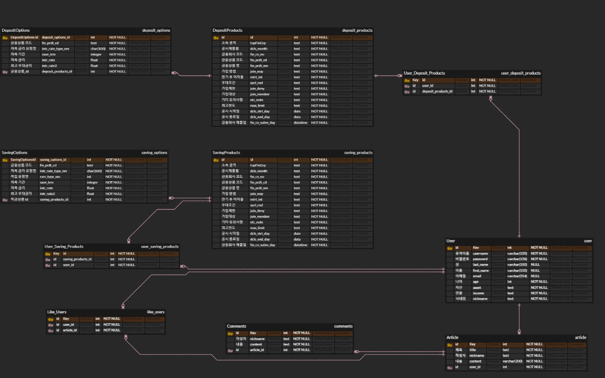
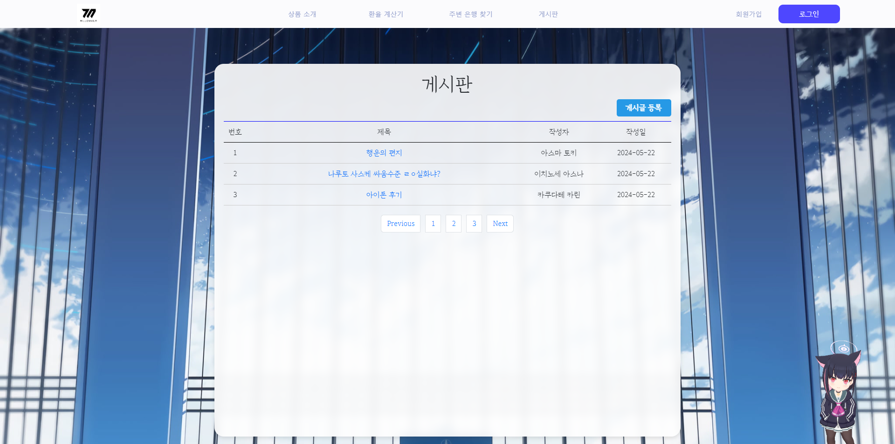
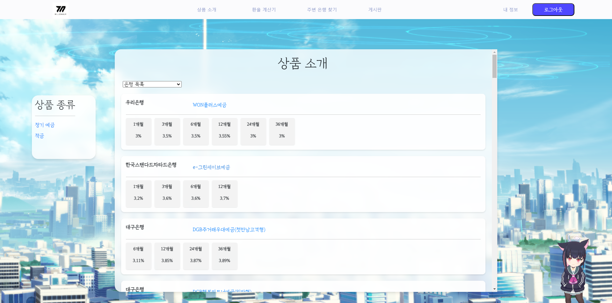

# Final pjt


### 목차

##### I. 팀원 정보 및 업무 분담 내역

##### II. 설계 내용 및 실제 구현 정도

##### III. 데이터베이스 모델링(ERD)

##### IV. 금융 상품 추천 알고리즘에 대한 기술적 설명

##### V. 서비스 대표 기능들에 대한 설명

##### VI. 느낀점, 후기


---
#### 팀원 정보 및 업무 분담내역
---
|이름|업무|
|---|---|
|김혁(팀장)|Front - front end 전반, erd, ppt|
|신우호|Back - back end 전반, 주변 은행검색, 챗봇|


---
#### 설계 내용 및 실제 구현 정도
---
front
- language

    ```
    javascript
    ```
- framework

    ```
    Vue3
    pinia
    axios
    chart.js
    ```

back
- language

    ```
    python
    ```
- framework

    ```
    django
    django-rest-framework
    dj-rest-auth
    pillow
    ```


---
#### 데이터베이스 모델링(ERD)
---



---
#### 금융 상품 추천 알고리즘에 대한 기술적 설명
---

##### 추천 알고리즘

유저에게 나이, 자산, 연봉을 회원가입시에 제공받습니다.
이를 토대로 10000명의 유저 더미데이터를 생성하여 나이, 자산, 연봉이 비슷한 유저가 많이 가입한 상품을 추천해주는 상품입니다.

비슷한 유저는 이용자 기준 나이는 ± 5살, 자산구간이 같고 연봉 구간이 같은 유저라고 정의하였습니다.

만약, 비슷한 유저가 없을 경우 전체 유저 기준 많이 가입한 상품을 추천해 줍니다.

---
#### 서비스 대표 기능들에 대한 설명
---
##### 메인 페이지


carousel로 메인 페이지 상단을 꾸미고, 하단에는 챗봇과 사이트 설명을 배치하였습니다.

##### 로그인, 회원가입 페이지


회원가입에서 나이와 연봉, 자산을 데이터를 입력하여 이를 저장합니다. 연봉과 자산은 목록 중에 선택하게 하여 추천 알고리즘에서 데이터 입력 시에 더 빠른 출력을 가능하게 하였습니다.

##### 게시판




게시판은 기본적인 crud 기능과 게시물 안에서의 댓글 crud기능이 있습니다. 마음에 드는 게시물에 대한 각 게시물 추천기능이 있습니다.

##### 금융 상품 페이지




금융 상품 페이지 에서는 간략하게 중요한 정보만 표시하며 상품의 상세 페이지에서 그외의 정보를 상세하게 표시합니다.
금융 상품 명을 누르면 상세 페이지로 넘어갑니다. 상세페이지에는 가입버튼과 금리 그래프 그리고 상세 정보가 있습니다.

##### 환율 계산 페이지


환율 계산 페이지는 외화를 원으로 바꾸는 것을 기본으로 하며 교체 버튼을 누르면 원을 외화로 바꾸는 것으로 교체됩니다.

##### 주변 은행 검색 페이지


직접 지역을 선택하고 그 후 은행을 선택하고 검색 버튼을 누르면 해당 지역의 해당 은행들이 검색됩니다.

##### 프로필 페이지


프로필 페이지에서 회원가입시 본인이 입력했던 정보와 함께 본인이 가입한 상품을 확인할 수 있습니다. 이외에도 회원정보 수정과 회원탈퇴 기능이 있습니다.

##### GPT 도우미

GPT는 유저들이 헷갈릴 수 있는 용어들의 정의를 알려주고 추천 알고리즘을 통해 유저들에게 상품 추천을 할 수 있습니다. 다만 입력 데이터의 글자 수 제한으로 인해 CHATGPT와 대화하는 것과 크게 다르지 않습니다.


---
#### 느낀점, 후기

- 김혁 : 생각보다 많이 바쁘고 시간이 촉박합니다. 기획 단계에서 확실한 계획을 세우고 체계적으로 일을 진행하는 것의 중요성을 체감하였습니다. 또한 실제 실현 가능성에 대한 고찰이 부족하였습니다. 부족한 실력으로 하기 위해서는 검색과 정보교환이 중요하다는 것을 알았습니다. 
- 신우호 : 맨 처음 기획하는 시간을 충분히 가지는 것이 무엇보다 중요하다는 것을 깨달았습니다. 중간에 기능을 구현하다가 모델을 다시 갈아 엎어서 같은 일을 반복하다 보니 시간 관리도 어려웠습니다. 하지만, 프로젝트를 경험해본 것 자체가 의미가 있다고 생각합니다.
