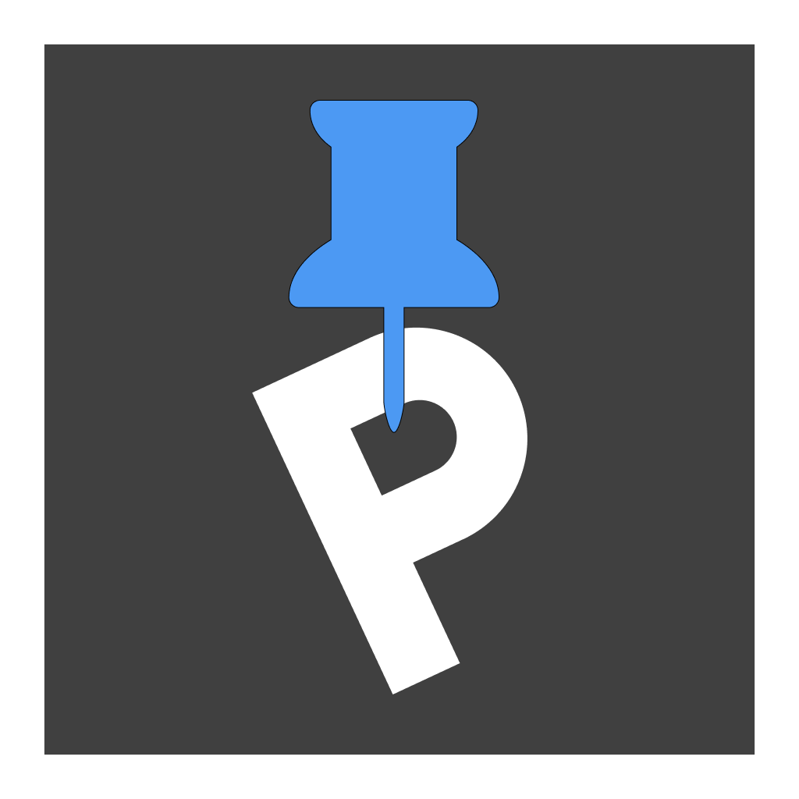

# 거주자 우선 주차 관리 앱, PICKINGPARKING 🚗

  

## 📅 프로젝트 정보

### SSAFY 11기 2학기 자율 프로젝트

2024.10.14(월) ~ 2024.11.19(화) [5주]

 

## 주제

유동 인구가 많은 지역에서의 주차가 힘든 시민들을 위한 **거주자 우선 주차 공유 플랫폼**

 

## 기획 배경

> 서울시의 주차난 증가!

- 서울시 평균 주차장 확보율 : 106.9%
- 2023년 서울시 불법 주·정차 민원 : 148만 3433건

> 타사 앱의 부족한 점

- 주차장 정보 부족
- 결제 정보 설명 부족

 

## 📝 기능 소개

> 거주자 우선 주차 구역 조회

> 주차 예약 및 현장 결제 지원

> OCR을 통한 차량 번호 판별

> 나의 거주자 우선 주차 등록

## 서비스 화면

|                                         |                                         |                                         |                                         |
| :-------------------------------------: | :-------------------------------------: | :-------------------------------------: | :-------------------------------------: |
|  |  |  |  |
|                메인 화면                |               주차장 등록               |               주차장 예약               |                내 주차장                |
|  |  |  |  |
|                예약 확인                |          **\*\***\_\_**\*\***           |          **\*\***\_\_**\*\***           |              **\_\_\_\_**               |

 

## 하드웨어

|                                         |                                         |                                         |                                         |
| :-------------------------------------: | :-------------------------------------: | :-------------------------------------: | :-------------------------------------: |
|  |  |  |  |
|               주차장 현황               |                OCR 확인                 |             \***\*\_\*\***              |              **\_\_\_\_**               |

## 🔎 기술 스택

    
  <!-- 
  
  
   -->

  <!-- 
   -->
  

  <!-- 
   -->
  

 

> Backend

  
  
  <!--  -->
  

  <!--  -->
  

 

> CI/CD

  
  
  
  

 

> Collaboration Tool

  
  
  
  
  

  
  

 

## 🧩 ERD

 

## 🗃️ 아키텍처

> 주요 아키텍처

- ## **OCR**
- ## **example**

 

## 🎨 화면 설계서

[🔗 Figma]()

## 🔃 API 명세서

> MySQL

 

 

## 🥝 팀원

| Name   | Roles              | GitHub                                       |
| :----- | :----------------- | :------------------------------------------- |
| 김근욱 | 팀장, Infra, CI/DC | [@your_id]()                                 |
| 김 혁  | Frontend           | [@your_id]()                                 |
| 민 호  | Frontend           | [@your_id]()                                 |
| 백승우 | Backend            | [@galler-ist](https://github.com/galler-ist) |
| 서현범 | Hardware           | [@your_id]()                                 |
| 신우호 | AI                 | [@your_id]()                                 |

<!-- > 우리 앱의 장점

- 현재 주차장 **상태 관리**
- 결제 시스템의 **간소화** -->
