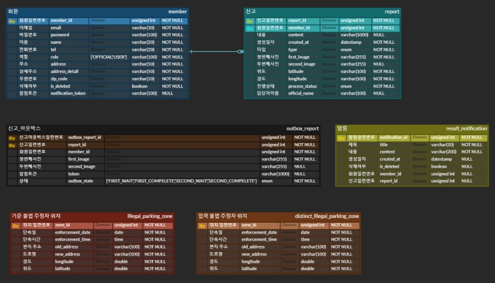
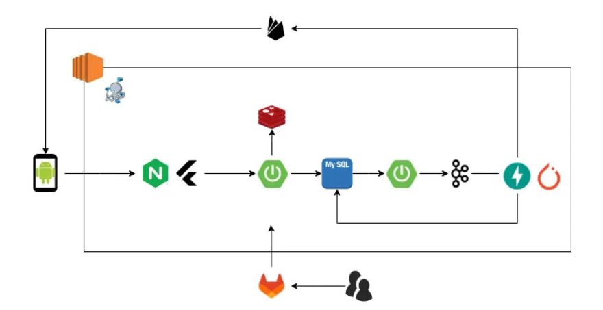
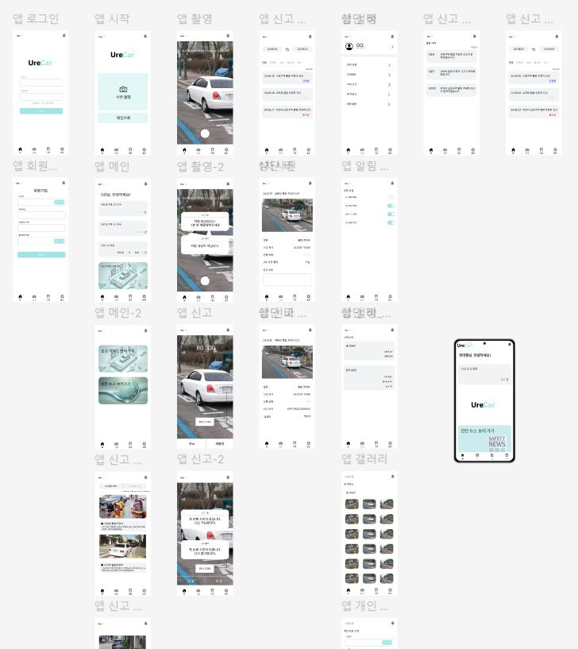

# 불법 주정차 신고 간편화 서비스, UreCar 🚗

  

## 📅 프로젝트 정보

### SSAFY 11기 2학기 특화 프로젝트

2024.08.26(화) ~ 2024.10.11(금) [7주]

 

## 주제

불법 주정차 신고 절차를 간소화하고 AI와 위치 데이터 통해 불법 여부를 판단하는 **불법 주정차 신고 간편화 서비스**

 

## 기획 배경

> 기존 불법 주정차 신고 앱 안전 신문고의 단점

- 복잡한 신고 절차
- 신고 과정에서의 유저 편의성이 낮음

 

## 📝 기능 소개
### :sweat_smile: 신고자

**신고 생성**  

불법주정차 사진을 촬영합니다.  
불법주정차 분석 성공(1-1)  
불법주정차 분석 실패(1-3)  

1-1. 불법주정차 분석 성공

- 주정차 확인을 위해 1분 대기합니다. 1분 후 알림을 받습니다.
- 불법주정차 관련 설명을 작성합니다.
- 1분 후 2차 사진을 촬영합니다.  
  - 불법주정차 분석 성공(1-2)
  - 불법주정차 분석 실패(1-3)

1-2. 2차 불법주정차 사진 분석 성공
- 신고 정보가 공무원에게 전달됩니다.

1-3. 불법주정차 분석 실패
- 신고가 취소됩니다.  
  
**신고 조회**
  - 신고한 정보들을 확인할 수 있습니다.
  - 날짜 별, 상태 별로 분류해 확인할 수 있습니다.
- 불법주정차 가이드 및 안전 뉴스 확인
  - 불법주정차에 대한 정보를 확인할 수 있습니다.
  - 안전 뉴스를 확인할 수 있습니다.  

### :sweat_smile: 공무원
- 분석 완료 신고 정보 조회 및 검사
  - AI 및 위치 검증이 완료된 신고 정보를 확인할 수 있습니다.
- 신고 정보에 대해 수용 or 불수용을 할 수 있습니다.
  - 신고 정보 수용
    - 신고 수용 알림이 신고자에게 전송됩니다.
  - 신고 정보 불수용
    - 신고 불수용 알림이 신고자에게 전송됩니다.

> 사진 촬영

- **1차 사진**
  - 
  - 
  - 
  - 
- **2차 사진**
  - 
  - 
  - 
  - 
- **신고 결과**
  - 
  - 

> 안전 뉴스 📢

- ****
  - 
  - 
  - 
  - 
- 
  - 
  - 
  - 
  - 
- 
  - 
  - 

> 신고 가이드 ⏰

- ****
  - 
  - 
  - 
  - 
  - 

 

## 📱 서비스 화면
|                                                                  |                                                                  |                                                                     |                                                                     |
|:----------------------------------------------------------------:|:----------------------------------------------------------------:|:-------------------------------------------------------------------:|:-------------------------------------------------------------------:|
|   |    |       |        |
|                              메인 페이지                              |                               신고조회                               |                                신고실패                                 |                                 갤러리                                 |
|   |  |  |      |
|                              알림 페이지                              |                              알림 상태바                              |                              불법주정차 가이드                              |                                마이페이지                                |
|  |    |  |  |
|                             로그인 페이지                              |                             회원가입 페이지                             |                             공무원 신고 리스트                              |                            공무원 신고 상세 페이지                            |

 

## 🔎 기술 스택

> Frontend

  
  
  
  

  
  
  

  
  
  

 

> Backend

  
  
  
  

  
  
  
  

 

> CI/CD

  
  
  
  
  

 

> Collaboration Tool

  
  
  
  
  
  

  
  
  

 

## 🧩 ERD

 

## 🗃️ 아키텍처

> 주요 아키텍처

- **MySQL & MongoDB**
  - 데이터의 특성에 맞는 DB를 사용하기 위해 2개로 나누어서 관리하였다.
  - MySQL은 관계형 데이터베이스로서 회원, 일정, 급식, 공지사항, 투약의뢰서, 귀가동의서와 같은 구조화된 데이터를 관리하는데 적합하다.
  - MongoDB는 비정형 데이터인 알림장, 메모 데이터를 저장하기에 적합하다.
  - 회원, 일정, 급식, 공지사항, 투약의뢰서, 귀가동의서 서비스와 알림장, 메모 서비스는 각각 사용하는 데이터가 철저하게 분리되어 있고, 2개의 DB를 모두 사용하는 요청하는 횟수가 매우 적어 두 개의 서버로 분리해 보다 효율적으로 관리하였다.
- **PWA**
  - Kidwe 서비스는 유치원 선생님이 일과 중 사용하기에 모바일 환경이 더욱 편리하다 생각했다.

 

## 🎨 화면 설계서

[🔗 Figma](<https://www.figma.com/design/CIgKnla27tmKOUzFrZiBKU/wow?node-id=0-1&node-type=canvas&t=hRaCLQ5Lg8yqNioX-0>)

 

## 🔃 API 명세서

> MySQL

 

 

## 🥝 팀원

| Name      | Roles                                   | GitHub                                         |
| :-------- | :-------------------------------------- | :--------------------------------------------- |
| 변지환 👑 | 팀장 | [@JihwanByun](https://github.com/JihwanByun)        |
| 김혁 🐹 | Frontend                                | [@ssafyhyuk](https://github.com/ssafyhyuk) |
| 권대형 🍀 | Frontend                           | [@doto3852](https://github.com/doto3852)   |
| 백승우 🐶 | AI                 | [@galler-ist](https://github.com/galler-ist)   |
| 박동환 🍬 | Backend                                 | [@ParkDH0809](https://github.com/ParkDH0809)   |
| 임준혁 🐰 | Backend, CI/CD                          | [@Im-Junhyuk](https://github.com/Im-Junhyuk)         |
